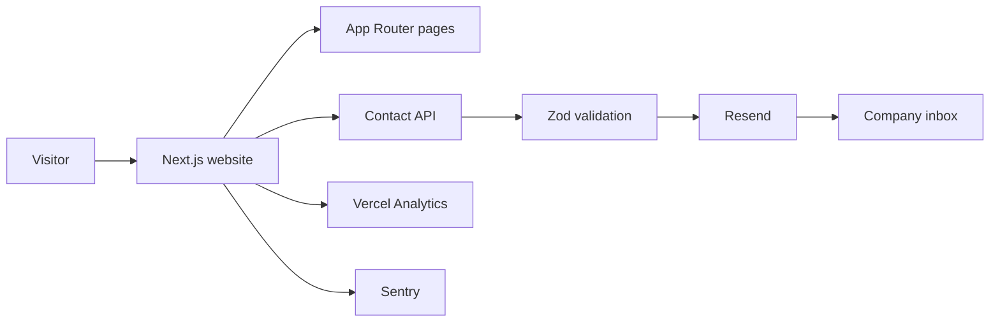

# Aasiana Aerotech

Production website for **Aasiana Aerotech**, an aviation regulatory and
technical consultancy supporting airworthiness, DGCA liaison, aircraft
induction, operational permissions, security approvals, and technical
documentation.

[Visit the website](https://www.aasianaaerotech.in) ·
[Report an issue](https://github.com/ADIBAINS/Aasiana-Aerotech-portfolio/issues)


## Highlights

- Responsive marketing website built with the Next.js App Router
- Service, company, client, and contact pages with reusable content models
- Server-side contact delivery through Resend
- Shared Zod validation with field-level feedback and spam honeypot protection
- SEO metadata, canonical URLs, sitemap, robots rules, manifest, Open Graph,
  and `ProfessionalService` structured data
- Vercel Analytics and Speed Insights
- Privacy-filtered Sentry error and performance monitoring
- Security headers and Content Security Policy
- Accessible navigation, forms, loading states, error boundaries, and reduced
  motion support
- GitHub Actions checks for linting, type safety, and production builds

## Architecture



The website is a single Next.js application. Public pages are server-rendered,
while the contact form is an interactive client component that submits to
`POST /api/contact`. The API validates and normalizes the request, filters
honeypot submissions, escapes user-controlled HTML, and sends both plain-text
and HTML email versions.

## Technology

| Area | Technology |
| --- | --- |
| Framework | Next.js 15, React 19, TypeScript |
| Styling | Custom responsive CSS |
| Motion and icons | Framer Motion, Lucide React |
| Validation | Zod |
| Email | Resend |
| Monitoring | Sentry |
| Product analytics | Vercel Analytics and Speed Insights |
| Testing | ESLint, TypeScript, Playwright |
| Deployment | Vercel |

## Local development

Requirements:

- Node.js 22+
- npm
- A Resend API key only when testing real contact delivery

```bash
git clone https://github.com/ADIBAINS/Aasiana-Aerotech-portfolio.git
cd Aasiana-Aerotech-portfolio
npm ci
cp .env.example .env.local
npm run dev
```

Open [http://localhost:3000](http://localhost:3000).

The website works without email credentials, but contact submissions return a
configuration message until the three Resend variables are provided.

## Environment variables

Copy `.env.example` to `.env.local`. Never commit real credentials.

| Variable | Required | Purpose |
| --- | --- | --- |
| `RESEND_API_KEY` | For contact delivery | Server-side Resend credential |
| `CONTACT_FROM_EMAIL` | For contact delivery | Sender on a Resend-verified domain |
| `CONTACT_TO_EMAIL` | For contact delivery | Inbox receiving enquiries |
| `NEXT_PUBLIC_SITE_URL` | Production | Canonical public URL |
| `NEXT_PUBLIC_CONTACT_EMAIL` | Recommended | Public contact email |
| `NEXT_PUBLIC_CONTACT_PHONE` | Optional | Display-formatted phone number |
| `NEXT_PUBLIC_CONTACT_PHONE_HREF` | Optional | Phone number used by `tel:` links |
| `NEXT_PUBLIC_CONTACT_WHATSAPP` | Optional | WhatsApp number without formatting |
| `NEXT_PUBLIC_CONTACT_ADDRESS` | Optional | Public office location |
| `NEXT_PUBLIC_CONTACT_HOURS` | Optional | Public operating hours |
| `NEXT_PUBLIC_LINKEDIN_URL` | Optional | Company LinkedIn page |
| `NEXT_PUBLIC_SENTRY_DSN` | Optional | Browser monitoring DSN |
| `SENTRY_DSN` | Optional | Server and edge monitoring DSN |
| `SENTRY_ORG` | Sentry releases | Sentry organization slug |
| `SENTRY_PROJECT` | Sentry releases | Sentry project slug |
| `SENTRY_AUTH_TOKEN` | Sentry releases | Build-only source-map upload token |

`SENTRY_AUTH_TOKEN` must remain server/build-only and must never use a
`NEXT_PUBLIC_` prefix.

## Commands

```bash
npm run dev          # development server
npm run lint         # ESLint checks
npm run typecheck    # TypeScript checks
npm run build        # optimized production build
npm run start        # serve the production build
npm run test:e2e     # Playwright contact-form tests
npm run test:e2e:ui  # Playwright interactive mode
```

The Playwright contact submission test sends through the configured contact
API. Use test email credentials or point `PLAYWRIGHT_BASE_URL` at an approved
preview deployment.

## Project layout

```text
app/
├── api/contact/      Contact email endpoint
├── about/            Company profile
├── contact/          Enquiry page
├── services/         Service catalogue
├── layout.tsx        Global metadata, analytics, and structured data
└── page.tsx          Homepage
components/           Shared interface and form components
lib/                  Site content, validation, URL, and privacy helpers
e2e/                  Playwright scenarios
public/images/        Brand, service, social, and client assets
```

Service descriptions and public company details are centralized in
`lib/site.ts`. Deployment-specific contact values come from environment
variables.

## Contact API safeguards

`POST /api/contact` includes:

- JSON content-type enforcement
- 16 KB payload limit
- server-side Zod validation and normalization
- hidden honeypot spam filtering
- HTML escaping before email rendering
- consent validation
- structured logs with request IDs and duration
- no logging of visitor messages or contact details
- Sentry capture for server and provider failures

Production should also apply a Vercel Firewall rule to `POST /api/contact`.
A practical starting limit is five requests per minute per IP, followed by
monitoring and adjustment.

## Deployment

1. Import the repository into Vercel.
2. Add the production environment variables from `.env.example`.
3. Verify the sending domain in Resend before setting `CONTACT_FROM_EMAIL`.
4. Set `NEXT_PUBLIC_SITE_URL` to the final HTTPS domain.
5. Enable Vercel Web Analytics and Speed Insights.
6. Configure the Sentry Next.js project and source-map upload token.
7. Add the contact API firewall rate limit.
8. Deploy and verify contact delivery, metadata, sitemap, and monitoring.

GitHub Actions runs lint, type checking, and a production build for pushes to
`main` and `dev`, and for pull requests targeting `main`.

## Privacy and monitoring

Sentry is disabled when no DSN is configured. When enabled, it samples 10% of
performance traces and removes users, request bodies, cookies, headers, and
query strings before events are sent. Default PII collection is disabled.

Client logos remain the property of their respective owners and are displayed
for identification only.
